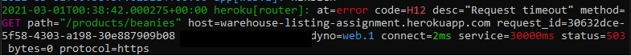

# **Reaktor Assignment**

## Availability

Project is deployed and accessable in [Heroku](https://warehouse-listing-assignment.herokuapp.com/) but because of the Herokus´ own restrictions on request timeouts which appears to be too time consuming for me at this moment, the app is only usable in localhost

### Installation

* Clone the repo

* cd ReaktorAssignment

* npm install

* npm start

* Application is accessible in http://localhost:3001/

## About the app

The basic idea is that the wanted product type to be listed is selected in the client

After this the client sents a request to a server which will take care of API-calls to the customer´s badapi

Server will make multiple requests and will build a single array containing all the product information including its availability

Server will then return this array and the client will render this array into a table

## Evaluation

Over 95% of the work has been done in 2 days and that shows for example in error handling and as a lack of well structured project

The solution is great by presenting all the entries by product type at once and handling all the data processing in the server side

The obvious con is that since the api which provides the availability info is so incredibly slow, the server can´t provide response fast

## Closing

I had a great 2 days while working on this assignment! While I´m not happy with the result as it certainly lacks certain aspects, which would require some time to think through, I definitely learned and gained experience working with web development

## Assignment

Copied from [here](https://www.reaktor.com/junior-dev-assignment/)

Instructions
Your client is a clothing brand that is looking for a simple web app to use in their warehouses. To do their work efficiently, the warehouse workers need a fast and simple listing page per product category, where they can check simple product and availability information from a single UI. There are three product categories they are interested in for now: gloves, facemasks, and beanies. Therefore, you should implement three web pages corresponding to those categories that list all the products in a given category. One requirement is to be easily able to switch between product categories quickly. You are free to implement any UI you want, as long as it can display multiple products at once in a straightforward and explicit listing. At this point, it is not necessary to implement filtering or pagination functionality on the page.

The client does not have a ready-made API for this purpose. Instead, they have two different legacy APIs that combined can provide the needed information. The legacy APIs are on critical-maintenance-only mode, and thus further changes to them are not possible. The client knows the APIs are not excellent, but they are asking you to work around any issues in the APIs in your new application. The client has instructed you that both APIs have an internal cache of about 5 minutes.

API documentation is as follows

GET /v2/products/:category – Return a listing of products in a given category.

GET /v2/availability/:manufacturer – Return a list of availability info.

The APIs are running at https://bad-api-assignment.reaktor.com/.
Your task is to implement a web application that fits the client brief and host the running solution somewhere where it can be accessed publicly (e.g. Heroku). Please include a link to the source code and the running application in your application.

Some pointers you might want to take into account

You can keep the UI side simpler than it would be in a real-life situation. You do not need to implement filtering, search, or pagination.
Be mindful of page loading speed and error handling in the application code itself, but using free hosting options with long-ish startup times on the first load is fine.
The API is supposed to resemble working with a real-life legacy API. It has a built-in intentional failure case that you might run into while developing. To ease up reproducing the issue without needing to wait for the next random request failure, we provide a request header: x-force-error-mode. Set to allto force the failure to reproduce.
Have fun! We’re looking forward to seeing your solution 😊